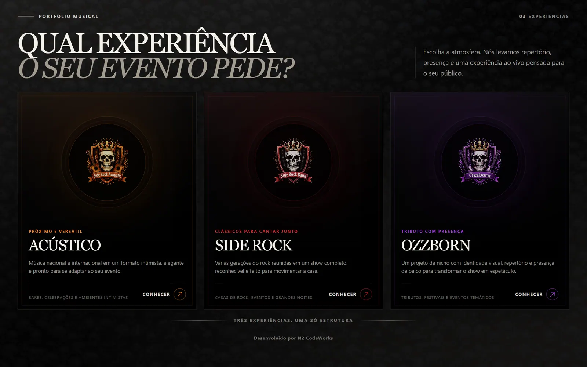
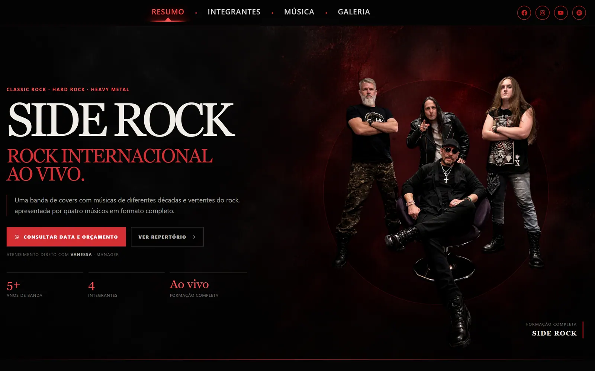
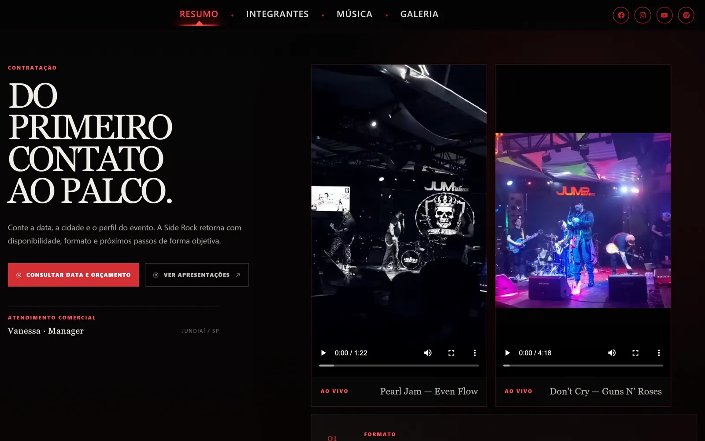
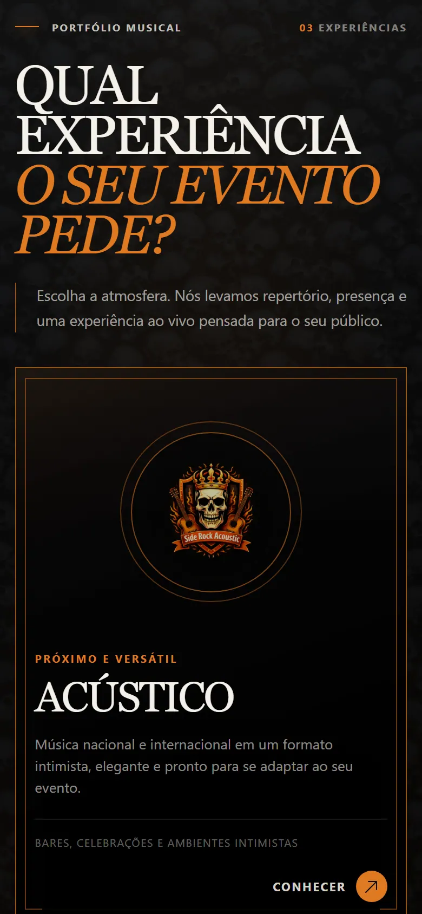

# SideRock

Site institucional e comercial para três experiências musicais que compartilham a mesma estrutura digital, sem misturar identidade: **Side Rock**, **Side Rock Acústico** e **Ozzborn**.

O projeto é um catálogo front-end em **React 19**, **TypeScript**, **Vite 7** e **React Router**. A home reúne as três formações; cada uma também possui rota própria para apresentação e contratação. O trabalho está em desenvolvimento ativo: o catálogo e a landing da Side Rock já estão implementados, enquanto Acústico e Ozzborn ainda usam uma apresentação provisória.



## Sobre o projeto

SideRock organiza, em um único domínio, o que antes precisaria de sites separados. A home funciona como vitrine institucional. Os links diretos (`/side-rock`, `/acoustic`, `/ozzborn`) existem para que um contratante chegue na formação certa sem passar pelo catálogo.

A decisão de produto por trás da arquitetura é:

> Compartilhar estrutura sem compartilhar personalidade.

Navbar, seções, CTAs, temas e engenharia podem ser reutilizados. Paleta, fotografia, linguagem e atmosfera pertencem a cada experiência.

## O problema

Três formações atendem eventos diferentes, com repertório, visual e posicionamento próprios:

- a banda completa de rock internacional;
- o formato acústico, mais próximo e versátil;
- o tributo com identidade de palco específica.

Se o site unificar demais as marcas, o visitante não entende o que está contratando. Se separar demais a engenharia, cada frente vira um produto isolado, mais caro de manter e inconsistente na navegação.

O site também precisa cumprir um papel comercial claro: apresentar a proposta, diferenciar as experiências e encaminhar o contato para contratação.

## A solução

Um ecossistema com duas camadas:

1. **Catálogo** em `/`, com identidade institucional própria. Não herda o vermelho da Side Rock como padrão; começa neutro e assume a cor da experiência ativa.
2. **Landings independentes**, para que cada formação possa ser enviada como um link único.

Hoje essa arquitetura de rotas já existe. A landing mais completa é a da Side Rock. Acústico e Ozzborn têm caminho próprio, mas o conteúdo visual dessas páginas ainda está em construção.

## Experiências

| Experiência | Rota | Estado atual |
| --- | --- | --- |
| **Side Rock** | `/side-rock` → `/side-rock/resumo` | Landing implementada, com hero, história, repertório de referências e contratação |
| **Side Rock Acústico** | `/acoustic` | Rota ativa, com navegação compartilhada e apresentação provisória |
| **Ozzborn** | `/ozzborn` | Rota ativa, com navegação compartilhada, diálogo introdutório e seleção visual de integrantes |

A home lista as três opções com fotografia, descrição e indicação de uso:

- **Side Rock** — classic rock, hard rock e heavy metal em formação completa, para casas de rock, eventos e noites maiores.
- **Side Rock Acústico** — formato intimista, com repertório nacional e internacional, para bares, celebrações e ambientes menores.
- **Ozzborn** — tributo com presença de palco, pensado para eventos temáticos e festivais.

`/ozzborns` continua funcionando e redireciona para `/ozzborn`, para não quebrar links antigos. Endereços inexistentes caem em uma página 404 que devolve o visitante ao catálogo.

## Funcionalidades

O que está de fato no código e nas rotas atuais:

- Catálogo central das três experiências, com cards, copy comercial e atalho para cada formação
- Identidade visual dinâmica na home: acento, atmosfera e scrollbar mudam conforme a experiência ativa
- Rotação automática das identidades no catálogo em viewport estreita ou toque; no desktop, a troca ocorre por hover e foco
- Landing da Side Rock com hero, fatos da banda, texto institucional e faixa de referências de repertório
- Área de contratação com WhatsApp, Instagram e vídeos locais de apresentações
- Pausa coordenada dos players: ao iniciar um vídeo, os outros da mesma fileira param
- Navegação da Side Rock entre Resumo, Integrantes, Música e Galeria
- Navbar responsiva, com tabs em scroll quando o espaço é curto
- Integração comercial da Side Rock com WhatsApp e Instagram
- Seleção visual de integrantes na rota do Ozzborn, por hover e clique sobre a fotografia
- Página 404 e redirecionamentos de `/side-rock` e `/ozzborns`

Ainda não fazem parte da entrega atual como seções prontas: o conteúdo de Integrantes, Música e Galeria da Side Rock, e as landings definitivas de Acústico e Ozzborn. As rotas de Música e Galeria existem e exibem placeholder.

## Arquitetura e decisões técnicas

A configuração das experiências fica centralizada. `src/config/experiences.ts` define as rotas canônicas e o redirecionamento legado. `src/Pages/HomePage/homeExperiences.ts` descreve nome, caminho, imagem, copy e tema de cada card. Incluir uma quarta experiência no catálogo é, em grande parte, acrescentar dados — não copiar layout.

A home trata a experiência ativa como `id | null`. `null` é o estado institucional (carvão, grafite, prata). As cores não estão espalhadas em seletores por marca: o CSS consome variáveis como `--catalog-accent`. A scrollbar segue o mesmo contrato, via `useScrollbarTheme`.

A Side Rock usa um shell próprio (`SideRockSectionPage`) com navbar, fundo em artboard e scroll interno. O Resumo sai desse modelo rígido de arte completa e flui como landing, o que permite empilhar hero, história, contratação e repertório sem forçar um único PNG de tela inteira.

Radix UI entra nas rotas ainda provisórias de Acústico e Ozzborn (`Dialog` e `Menubar`). O catálogo e a landing da Side Rock são compostos com HTML, CSS Modules e React Router.

Outras decisões visíveis no código:

- **React Router 7** com rotas planas, sem layout aninhado com `<Outlet />` na Side Rock
- **Responsividade** com breakpoints explícitos em `src/utils/viewport.ts` (760px para mobile, 590px para empilhar a nav)
- **Acessibilidade** com `aria-label` / `aria-labelledby` nas regiões principais, texto alternativo na foto da banda, `sr-only` onde o visual é decorativo, e `prefers-reduced-motion` no catálogo, na navbar e na landing
- **Mídia**: vídeos empacotados no bundle, player nativo, `playsInline`, `preload="metadata"`, sem autoplay; fotografias e fundos importados pelo Vite
- **SPA**: `vercel.json` reescreve caminhos da aplicação para `index.html`, para links diretos como `/side-rock/resumo` não quebrarem no deploy

## Tecnologias

- React 19
- TypeScript
- Vite 7
- React Router DOM 7
- Radix UI
- React Icons
- ESLint 9
- CSS Modules

## Screenshots

Catálogo institucional, com as três experiências lado a lado:


Landing da Side Rock, com identidade própria, hero e caminho para contratação:



Área de contratação, com WhatsApp, Instagram e vídeos de apresentações:



O mesmo catálogo em viewport mobile, com a identidade da experiência em rotação:



## Estrutura do projeto

```text
src/
├── assets/              # Fotografias, vídeos e mídia usada nas páginas
├── Components/          # Peças compartilhadas (crédito, dialog, nav, foto dos integrantes)
├── config/              # Rotas canônicas das experiências
├── hooks/               # Tema da scrollbar e efeitos globais
├── Pages/
│   ├── HomePage/        # Catálogo institucional
│   ├── SideRockPage/    # Landing e seções da Side Rock
│   ├── AcousticPage/    # Rota do Side Rock Acústico
│   ├── OzzbornPage/     # Rota do Ozzborn
│   └── NotFound/
├── SiderockAssets/      # Fundos e referências visuais
└── utils/               # Viewport e helpers de layout

docs/
├── PROJETO_ATUAL.md     # Contexto interno de produto
└── screenshots/         # Imagens deste README
```

## Como executar

Requisito: **Node.js 20** ou superior. O workflow de CI usa Node 20; o Vite 7 pede essa faixa.

```bash
npm install
npm run dev
```

Outros scripts:

```bash
npm run build      # typecheck (tsc -b) e build de produção
npm run lint       # ESLint
npm run preview    # serve o build gerado em dist/
```

A aplicação sobe em `http://localhost:5173` (ou na próxima porta livre). Não há backend: o contato comercial da Side Rock abre WhatsApp e Instagram em nova aba.

## Status atual

Implementado:

- Catálogo com três experiências e troca de atmosfera
- Rotas independentes para cada formação
- Landing da Side Rock (resumo + contratação + vídeos)
- Redirecionamentos `/side-rock` → `/side-rock/resumo` e `/ozzborns` → `/ozzborn`
- Página 404
- Rewrite SPA para Vercel
- Workflow de deploy para GitHub Pages

Em evolução:

- Conteúdo das seções Integrantes, Música e Galeria da Side Rock
- Landings definitivas de Side Rock Acústico e Ozzborn
- Links sociais ainda placeholder na navbar (Facebook, YouTube, Spotify)
- Composição visual em camadas no lugar de alguns fundos de artboard
- Aprofundamento de acessibilidade e de carregamento de mídia

O repositório não publica uma URL de produção estável neste README. Há configuração de GitHub Pages e de Vercel, mas o endereço público não está confirmado aqui.

## Próximos passos

A prioridade visível no próprio código é completar a Side Rock como landing comercial e, em seguida, dar a Acústico e Ozzborn o mesmo grau de identidade — reusando o que for estrutura, sem copiar a personalidade da banda principal. Não há prazo anunciado para essas etapas.

## Desafios e aprendizados

O ponto mais difícil não é empilhar páginas: é deixar três marcas conviverem sem parecer o mesmo site com a logo trocada. Isso exigiu um estado neutro na home, temas por dados e uma quarta identidade só para o catálogo.

Outro equilíbrio é visual versus entrega. Fundos pesados, vídeos locais e fotografia de palco pedem cuidado com scroll, viewport e `preload`. A landing precisa impressionar, mas também precisa de contraste, movimento reduzido quando o sistema pede, e um caminho curto até o WhatsApp.

A Side Rock mostrou na prática a diferença entre um artboard de seção e uma landing que converte: o Resumo saiu do fundo único e passou a empilhar conteúdo comercial real.

## Autor

**Kaique Melo** · KaiD3v

- Portfólio: [kaidev.com.br](https://kaidev.com.br)
- LinkedIn: [linkedin.com/in/kaidev1](https://www.linkedin.com/in/kaidev1/)
- GitHub: [github.com/KaiD3v](https://github.com/KaiD3v)
